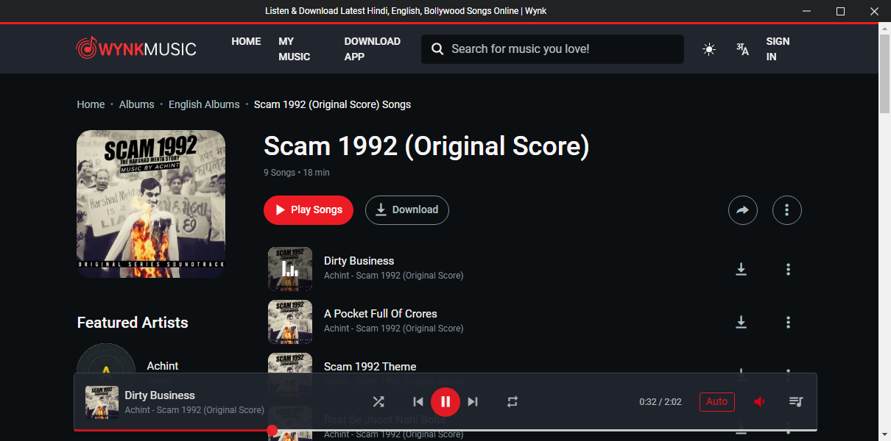

# Wynk music

[](https://GitHub.com/jothi-prasath/wynk-music/releases/)
[](https://github.com/jothi-prasath/wynk-music/issues)
[](https://github.com/jothi-prasath/wynk-music/network)
[](https://github.com/jothi-prasath/wynk-music/stargazers)


**Wynk music** is an Electron-based lightweight wynk client, available for Windows, Mac and Linux!

   **It is not a official desktop app**


## Install

  ```
  $ npm install
  ```
  ```
  $ npm start
  ```


## Features

**Wynk music** uses the GitHub-produced Electron framework to wrap around website [wynk.in](https://wynk.in) and added extra features to it.

- **Available for most desktop platforms** including Windows (7 or above), Linux and MacOS.
- **Lightweight** it uses less ram than your normal borwser

## Screenshots





## Feature Requests

In order to submit a feature request, create a [new issue](https://github.com/jothi-prasath/wynk-music/issues/new) with the label `enhancement`.

Please make sure that you provide a helpful description of your feature request. If possible, try implementing the feature yourself by forking this repository and then creating a pull request.


